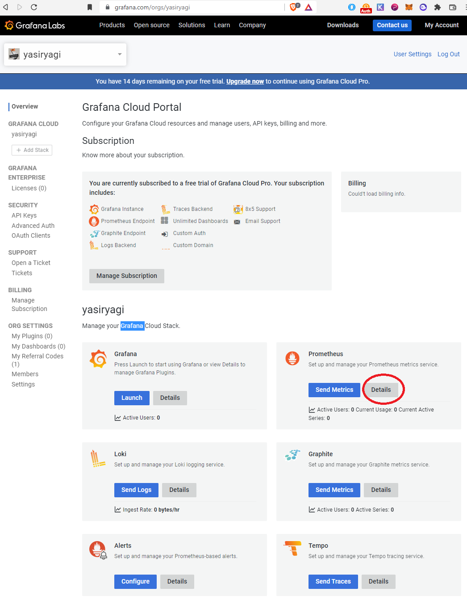
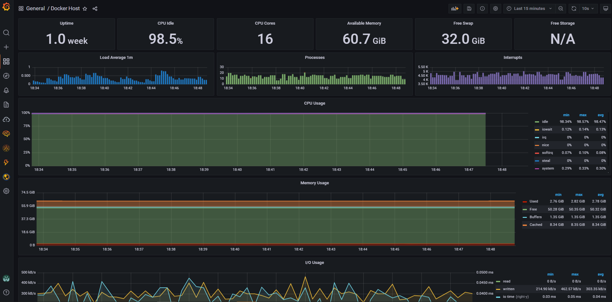
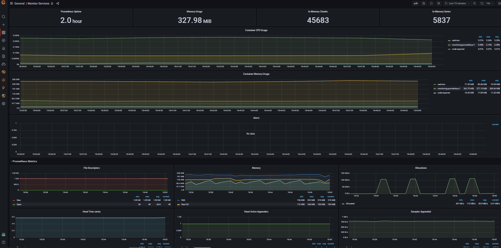
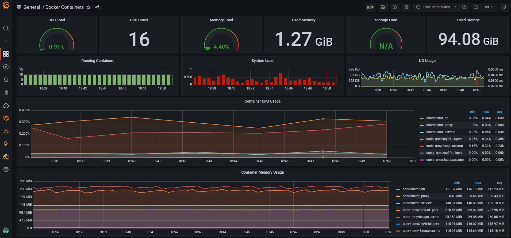

# Requirements 

apt install -y vim htop ca-certificates curl gnupg lsb-release
 

# Docker 

## Install docker

```
apt-get update
curl -fsSL https://download.docker.com/linux/ubuntu/gpg | sudo gpg --dearmor -o /usr/share/keyrings/docker-archive-keyring.gpg
echo \
  "deb [arch=$(dpkg --print-architecture) signed-by=/usr/share/keyrings/docker-archive-keyring.gpg] https://download.docker.com/linux/ubuntu \
  $(lsb_release -cs) stable" | sudo tee /etc/apt/sources.list.d/docker.list > /dev/null
apt-get update
apt-get install docker-ce docker-ce-cli containerd.io docker-compose-plugin
```

## Install docker-compose
```
curl -L https://github.com/docker/compose/releases/download/v2.5.0/docker-compose-linux-x86_64 -o /usr/local/bin/docker-compose
chmod +x /usr/local/bin/docker-compose
```


# Firewall (Optional)

```
cp firewall/after.rules /etc/ufw/after.rules
ufw allow ssh
ufw route allow proto tcp from any to any port 443
ufw route allow proto tcp from any to any port 9090
ufw enable 
```
> Add other system/ports that are needed.

# Run as a service


```
git clone https://github.com/yasiryagi/monitoring
cd monitoring 
cp service/monitoring.service /etc/systemd/system/monitoring.service
systemctl start monitoring.service
systemctl status monitoring.service
docker ps
docker-compose logs -f --tail 100
```
> Note: this guide created with the username root, if that is not the case review "WorkingDirectory=" in the service files.

# Grafana 

We will be using cloud grafana.
> [create an account](https://grafana.com/)


Click on the detail button to get your details to be used in the Prometheus config



## Get and install dashboard templates 


Import the dashboards from [here](./monitoring/dashboard).





# Ref
> https://grafana.com/orgs/**<username>**
> https://grafana.com/docs/grafana-cloud/quickstart/docker-compose-linux/
> https://github.com/stefanprodan/dockprom

